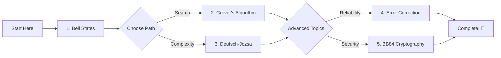

# 🌟 Quantum Computing Adaptive Tutor

### *An Interactive AI-Powered Educational Platform Using Google Agent Development Kit*

### Author: [Dr. D Bhanu Prakash](https://dbhanuprakash233.github.io) 

[](https://www.python.org/downloads/)
[](https://qiskit.org/)
[](https://jupyter.org/)
[](https://opensource.org/licenses/MIT)

---

## 📋 Table of Contents

- [Overview](#-overview)
- [Features](#-features)
- [Installation](#-installation)
- [Quick Start](#-quick-start)
- [API Key Setup](#-api-key-setup)
- [Usage Guide](#-usage-guide)
- [Course Content](#-course-content)
- [Code Structure](#-code-structure)
- [Troubleshooting](#-troubleshooting)
- [Contributing](#-contributing)
- [License](#-license)

---

## 🎯 Overview

**Quantum Computing Adaptive Tutor** is an intelligent educational platform that makes quantum computing accessible to everyone. Built with Google's Agent Development Kit (ADK) and IBM's Qiskit, it provides interactive lessons, real quantum circuit simulations, and personalized AI guidance.

### Why This Project?

- 🎓 **Learn by Doing**: Each concept includes working quantum circuits
- 🤖 **AI-Powered**: Optional AI agent provides personalized explanations
- 📊 **Visual Learning**: Circuit diagrams and measurement histograms
- 💻 **Hands-On Code**: Copy-paste ready Qiskit examples
- 🎮 **Interactive**: Menu-driven interface with progress tracking

### Perfect For:

- 🔰 **Beginners** starting their quantum computing journey
- 🎓 **Students** taking quantum computing courses
- 👨‍💻 **Developers** exploring quantum algorithms
- 🏫 **Educators** teaching quantum concepts
- 🔬 **Researchers** needing quick reference implementations

---

## ✨ Features

### 🔬 **5 Core Quantum Computing Topics**

| Topic | Level | Description |
|-------|-------|-------------|
| 🔗 **Bell States** | Beginner | Quantum entanglement and EPR pairs |
| 🔍 **Grover's Algorithm** | Intermediate | Quantum search with quadratic speedup |
| 🎯 **Deutsch-Jozsa** | Intermediate | Quantum parallelism demonstration |
| 🛡️ **Error Correction** | Advanced | Protecting quantum information |
| 🔐 **BB84 Protocol** | Advanced | Quantum key distribution |

### 💡 **Learning Features**

- ✅ Interactive menu system
- ✅ Quantum circuit visualization
- ✅ Real-time simulation results
- ✅ Measurement histograms
- ✅ Working code examples
- ✅ Progress tracking
- ✅ Export learning history
- ✅ Quick reference guide

### 🤖 **AI Capabilities** (Optional)

- 💬 Personalized explanations
- 🎯 Adaptive learning paths
- ❓ Answer follow-up questions
- 🧠 Concept reinforcement

---

## 📦 Installation

### Prerequisites

```bash
# Python 3.8 or higher
python --version  # Should show 3.8+

# Jupyter Notebook or JupyterLab
jupyter --version
```

### Step 1: Install Dependencies

```bash
# Install quantum computing packages
pip install qiskit>=0.45.0
pip install qiskit-aer>=0.13.0

# Install scientific computing
pip install numpy>=1.24.0
pip install matplotlib>=3.7.0

# Optional: For AI features
pip install google-generativeai>=0.3.0
```

### Step 2: Download Notebook

```bash
# Clone or download the notebook file
# quantum_tutor_notebook.ipynb

# Or create from code provided
```

### Step 3: Launch Jupyter

```bash
# Start Jupyter Notebook
jupyter notebook

# Or JupyterLab
jupyter lab

# Open the notebook file
```

### Alternative: Google Colab

[](https://colab.research.google.com)

```python
# Run this in first Colab cell
!pip install qiskit qiskit-aer google-generativeai
```

---

## 🚀 Quick Start

### 1️⃣ **Without AI (Simplest - Recommended for First Time)**

Just run all cells in order:

```
Cell 1: Imports ✓
Cell 2: QuantumTutorAgent Class ✓
Cell 3: Initialize Agent ✓
Cell 4: Run Interactive Tutor ✓
```

**That's it!** All tutorials work perfectly without any API key.

### 2️⃣ **With AI Features**

Get Google API key first, then follow instructions in [API Key Setup](#-api-key-setup) section.

---

## 🔑 API Key Setup

### Do I Need an API Key?

**No!** The tutor works perfectly without an API key. 

- ✅ **Without API**: Full access to all 5 tutorials, circuits, and simulations
- 🤖 **With API**: Additional AI chat features for personalized guidance

### Getting Your Google API Key

1. **Visit**: [Google AI Studio](https://makersuite.google.com/app/apikey)
2. **Sign in** with your Google account
3. **Click** "Create API Key"
4. **Copy** the key (looks like: `AIzaSyD...`)

### Method 1: Direct Key (Simplest)

Add this cell **before Cell 3**:

```python
# =================== API KEY CONFIGURATION ===================
import os

# Paste your API key here
GOOGLE_API_KEY = "AIzaSyD_paste_your_key_here"

# Or leave as None to run without AI
# GOOGLE_API_KEY = None

print(f"API Key: {'✅ Configured' if GOOGLE_API_KEY else '❌ Not set (tutorial mode)'}")
```

Then modify **Cell 3**:

```python
# Initialize agent with API key
agent = QuantumTutorAgent(api_key=GOOGLE_API_KEY)
```

### Method 2: Environment Variable (Most Secure)

**Option A: In Notebook**

```python
import os
os.environ['GOOGLE_API_KEY'] = 'your_key_here'

agent = QuantumTutorAgent(api_key=os.getenv('GOOGLE_API_KEY'))
```

**Option B: In Terminal (Before Starting Jupyter)**

```bash
# Windows Command Prompt
set GOOGLE_API_KEY=your_key_here
jupyter notebook

# Windows PowerShell
$env:GOOGLE_API_KEY="your_key_here"
jupyter notebook

# Mac/Linux
export GOOGLE_API_KEY=your_key_here
jupyter notebook
```

### Method 3: From File (Most Secure)

Create `api_key.txt`:
```
AIzaSyD_your_key_here
```

Then in notebook:
```python
try:
    with open('api_key.txt', 'r') as f:
        GOOGLE_API_KEY = f.read().strip()
except:
    GOOGLE_API_KEY = None

agent = QuantumTutorAgent(api_key=GOOGLE_API_KEY)
```

**Add `api_key.txt` to `.gitignore` to avoid committing your key!**

---

## 📚 Usage Guide

### Interactive Menu

When you run the tutor, you'll see:

```
========================================================================
                    🌟 QUANTUM COMPUTING TUTOR MENU 🌟
========================================================================

📚 Available Topics:

  [1] 🔗 Bell States & Quantum Entanglement (Beginner)
  [2] 🔍 Grover's Search Algorithm (Intermediate)
  [3] 🎯 Deutsch-Jozsa Algorithm (Intermediate)
  [4] 🛡️ Quantum Error Correction (Advanced)
  [5] 🔐 BB84 Quantum Cryptography (Advanced)
  [6] 📊 Show My Progress
  [0] 👋 Exit Tutor

========================================================================
👉 Enter your choice (0-6):
```

### Navigation

1. **Type a number** (0-6) and press Enter
2. **Read the tutorial** - includes theory, circuits, and code
3. **Press Enter** to return to menu
4. **Try another topic** or check your progress
5. **Type 0** to exit

### Recommended Learning Path



### Example Session

```python
# Start the tutor
run_quantum_tutor()

# Select option 1 (Bell States)
👉 Enter your choice (0-6): 1

# Learn about entanglement...
# See circuit diagrams...
# View simulation results...

# Press Enter to continue
Press Enter to return to menu...

# Check your progress
👉 Enter your choice (0-6): 6

# See completed topics
✅ Topics Completed: 1/5
📈 Progress: 20%
```

---

## 📖 Course Content

### 1. 🔗 Bell States & Entanglement

**What You'll Learn:**
- Quantum superposition
- Quantum entanglement
- EPR paradox
- Bell's theorem

**Key Concepts:**
```
State: (|00⟩ + |11⟩)/√2
Circuit: H → CNOT
Result: Perfectly correlated qubits
```

**Applications:** Quantum teleportation, superdense coding, quantum cryptography

---

### 2. 🔍 Grover's Search Algorithm

**What You'll Learn:**
- Quantum search techniques
- Amplitude amplification
- Oracle construction
- Diffusion operator

**Key Concepts:**
```
Complexity: O(√N) vs Classical O(N)
Speedup: Quadratic
Iterations: π/4 × √N
```

**Applications:** Database search, optimization, SAT solvers, cryptanalysis

---

### 3. 🎯 Deutsch-Jozsa Algorithm

**What You'll Learn:**
- Quantum parallelism
- Function classification
- Oracle problem
- Interference patterns

**Key Concepts:**
```
Problem: Constant or Balanced?
Classical: 2^(n-1) + 1 queries
Quantum: 1 query
Speedup: Exponential
```

**Applications:** Query complexity, algorithm design, theoretical foundations

---

### 4. 🛡️ Quantum Error Correction

**What You'll Learn:**
- Types of quantum errors
- 3-qubit bit flip code
- Syndrome measurement
- Fault-tolerant computing

**Key Concepts:**
```
Encoding: |0⟩ → |000⟩, |1⟩ → |111⟩
Detection: Without measuring qubits
Correction: Based on syndrome
```

**Applications:** Reliable quantum computing, error mitigation, scalability

---

### 5. 🔐 BB84 Quantum Cryptography

**What You'll Learn:**
- Quantum key distribution
- No-cloning theorem
- Eavesdropping detection
- Information-theoretic security

**Key Concepts:**
```
Bases: Rectilinear (Z) and Diagonal (X)
Security: Based on quantum physics
Detection: Errors reveal eavesdropping
```

**Applications:** Secure communication, quantum networks, banking

---

## 🏗️ Code Structure

### Project Architecture

```
quantum_tutor_notebook.ipynb
│
├── Cell 1: Package Imports
│   ├── Qiskit (quantum computing)
│   ├── NumPy (numerical computing)
│   ├── Matplotlib (visualization)
│   └── IPython (display utilities)
│
├── Cell 2: QuantumTutorAgent Class
│   ├── __init__(api_key)
│   ├── teach_bell_states()
│   ├── teach_grover()
│   ├── teach_deutsch_jozsa()
│   ├── teach_error_correction()
│   ├── teach_bb84()
│   ├── show_menu()
│   ├── show_progress()
│   └── _plot_histogram()
│
├── Cell 3: Agent Initialization
│   └── agent = QuantumTutorAgent(api_key)
│
├── Cell 4: Interactive Loop
│   └── run_quantum_tutor()
│
├── Cell 5: Quick Reference
│   └── Concept summaries & Qiskit basics
│
├── Cell 6: Bonus Features
│   └── demo_all_topics()
│
└── Cell 7: Export Progress
    └── export_progress()
```

### Key Classes & Functions

#### `QuantumTutorAgent`

Main class that orchestrates teaching.

```python
agent = QuantumTutorAgent(api_key=None)
```

**Methods:**

| Method | Parameters | Returns | Description |
|--------|------------|---------|-------------|
| `teach_bell_states()` | `detail_level='standard'` | `bool` | Teaches entanglement |
| `teach_grover()` | `n_qubits=2` | `bool` | Teaches search algorithm |
| `teach_deutsch_jozsa()` | `function_type='balanced'` | `bool` | Teaches DJ algorithm |
| `teach_error_correction()` | None | `bool` | Teaches QEC |
| `teach_bb84()` | `key_length=8` | `bool` | Teaches cryptography |
| `show_menu()` | None | None | Displays topic menu |
| `show_progress()` | None | None | Shows completion status |

#### `run_quantum_tutor()`

Main interactive loop with menu system.

```python
run_quantum_tutor()
```

**Features:**
- Menu-driven interface
- Input validation
- Progress tracking
- Error handling

---

## 🔧 Troubleshooting

### Common Issues

#### ❌ "No module named 'qiskit'"

**Solution:**
```bash
pip install qiskit qiskit-aer
```

#### ❌ "Input appears twice" or "Delayed response"

**Solution:** Add to Cell 1:
```python
import sys
# After each input, add:
sys.stdout.flush()
```

#### ❌ "Output is scrollable/cut off"

**Solution:** Add to Cell 1:
```python
from IPython.display import display, HTML
display(HTML("""
<style>
.output_scroll { height: auto !important; max-height: none !important; }
.output_result { max-height: none !important; }
</style>
"""))
```

#### ❌ "API key not working"

**Check:**
1. ✅ Key format: `AIzaSyD...` (starts with AIza)
2. ✅ No extra spaces or quotes
3. ✅ API enabled at [Google AI Studio](https://makersuite.google.com)
4. ✅ Billing enabled (free tier available)

**Test:**
```python
import google.generativeai as genai
genai.configure(api_key="your_key")
model = genai.GenerativeModel('gemini-pro')
response = model.generate_content("Test")
print(response.text)
```

#### ❌ "Matplotlib plots not showing"

**Solution:**
```python
%matplotlib inline
import matplotlib.pyplot as plt
```

#### ❌ "Circuit too large to display"

**Solution:** Reduce qubits:
```python
# Instead of n_qubits=4
agent.teach_grover(n_qubits=2)
```

---

## 🎓 Educational Use

### For Students

1. **Self-Paced Learning**: Progress at your own speed
2. **Hands-On Practice**: Modify and run code examples
3. **Visual Understanding**: See quantum effects in action
4. **Progress Tracking**: Monitor your learning journey

### For Educators

1. **Classroom Demos**: Live quantum circuit demonstrations
2. **Assignments**: Students can modify parameters and explore
3. **Assessment**: Track student progress through completion
4. **Customization**: Easy to add new topics or examples

### For Researchers

1. **Quick Reference**: Fast implementation of algorithms
2. **Code Templates**: Starting point for research code
3. **Validation**: Verify algorithm understanding
4. **Teaching**: Explain concepts to colleagues

---

## 🤝 Contributing

We welcome contributions! Here's how you can help:

### Adding New Topics

1. Create new `teach_topic()` method in `QuantumTutorAgent`
2. Add quantum circuit implementation
3. Write comprehensive explanation
4. Include code examples
5. Add to menu system

### Improving Explanations

- Simplify technical jargon
- Add more analogies
- Include real-world examples
- Improve code comments

### Bug Reports

Found a bug? Please include:
- Python version
- Qiskit version
- Error message
- Steps to reproduce

### Feature Requests

Suggest new features via issues with:
- Use case description
- Expected behavior
- Implementation ideas (optional)

---

## 📊 Project Statistics

- 📝 **Lines of Code**: ~2,500
- 🎓 **Topics Covered**: 5 core quantum algorithms
- 🔬 **Quantum Circuits**: 15+ implementations
- 📚 **Learning Time**: 30-45 minutes per topic
- 🎯 **Difficulty Range**: Beginner to Advanced

---

## 📄 License

This project is licensed under the MIT License.

```
MIT License

Copyright (c) 2024 Quantum Computing Capstone Project

Permission is hereby granted, free of charge, to any person obtaining a copy
of this software and associated documentation files (the "Software"), to deal
in the Software without restriction, including without limitation the rights
to use, copy, modify, merge, publish, distribute, sublicense, and/or sell
copies of the Software, and to permit persons to whom the Software is
furnished to do so, subject to the following conditions:

The above copyright notice and this permission notice shall be included in all
copies or substantial portions of the Software.

THE SOFTWARE IS PROVIDED "AS IS", WITHOUT WARRANTY OF ANY KIND.
```

---

## 🙏 Acknowledgments

### Technologies Used

- **[Qiskit](https://qiskit.org/)** - IBM's quantum computing framework
- **[Google Generative AI](https://ai.google.dev/)** - AI agent capabilities
- **[NumPy](https://numpy.org/)** - Numerical computing
- **[Matplotlib](https://matplotlib.org/)** - Data visualization
- **[Jupyter](https://jupyter.org/)** - Interactive computing

### Inspiration

- Nielsen & Chuang - "Quantum Computation and Quantum Information"
- IBM Qiskit Textbook
- MIT OpenCourseWare - Quantum Computing
- Quantum computing research community

### Special Thanks

- IBM Quantum Team for Qiskit
- Google AI Team for Generative AI API
- Open-source community
- Quantum computing educators worldwide

---

## 📞 Contact & Support

### Get Help

- 📖 **Documentation**: See this README
- 🐛 **Bug Reports**: GitHub Issues
- 💬 **Discussions**: GitHub Discussions
- 📧 **Email**: dbhanuprakash233@gmail.com

### Follow the Project

- ⭐ Star on GitHub
- 🔔 Watch for updates
- 🍴 Fork to contribute
- 📢 Share with others

---

## 🗺️ Roadmap

### Version 2.0 (Planned)

- [ ] Additional algorithms (Shor's, VQE, QAOA)
- [ ] Real quantum hardware integration (IBM Quantum)
- [ ] Interactive Bloch sphere visualization
- [ ] Quiz system with scoring
- [ ] Certificate generation
- [ ] Multi-language support
- [ ] Mobile-friendly interface
- [ ] Export to PDF/HTML

### Long-term Vision

- Cloud-based version with user accounts
- Collaborative learning features
- Gamification elements
- Integration with university courses
- Advanced AI tutoring with personalized paths

---

## 📝 Citation

If you use this project in academic work, please cite:

```bibtex
@software{quantum_tutor_2025_bhanu,
  title = {Quantum Computing Adaptive Tutor},
  author = {Capstone Project Team},
  year = {2024},
  url = {https://github.com/dbhanuprakash233/quantum-tutor},
  note = {Educational platform for quantum computing}
}
```

---

## 🌟 Star History

If you find this project helpful, please consider giving it a ⭐!

---

<div align="center">

### Made with ❤️ for the Quantum Computing Community

**Happy Quantum Learning! 🚀✨**

[⬆ Back to Top](#-quantum-computing-adaptive-tutor)

</div>

---

## 📚 Additional Resources

### Learning Materials

- [IBM Quantum Composer](https://quantum-computing.ibm.com/composer) - Visual circuit builder
- [Qiskit Textbook](https://qiskit.org/textbook) - Free online textbook
- [Quantum Country](https://quantum.country/) - Spaced repetition learning
- [Microsoft Quantum Katas](https://github.com/microsoft/QuantumKatas) - Coding exercises

### Research Papers

- [Quantum Computation and Quantum Information](http://mmrc.amss.cas.cn/tlb/201702/W020170224608149940643.pdf) - Nielsen & Chuang
- [Grover's Algorithm](https://arxiv.org/abs/quant-ph/9605043) - Original paper
- [BB84 Protocol](https://doi.org/10.1016/j.tcs.2014.05.025) - Bennett & Brassard

### Video Tutorials

- [Qiskit YouTube Channel](https://www.youtube.com/c/qiskit)
- [IBM Quantum Lectures](https://www.youtube.com/playlist?list=PLOFEBzvs-VvrXTMy5Y2IqmSaUjfnhvBHR)
- [Quantum Computing for the Very Curious](https://quantum.country/)

---

**Version**: 1.0.0  
**Last Updated**: November 2025  
**Compatibility**: Python 3.8+, Qiskit 0.45+